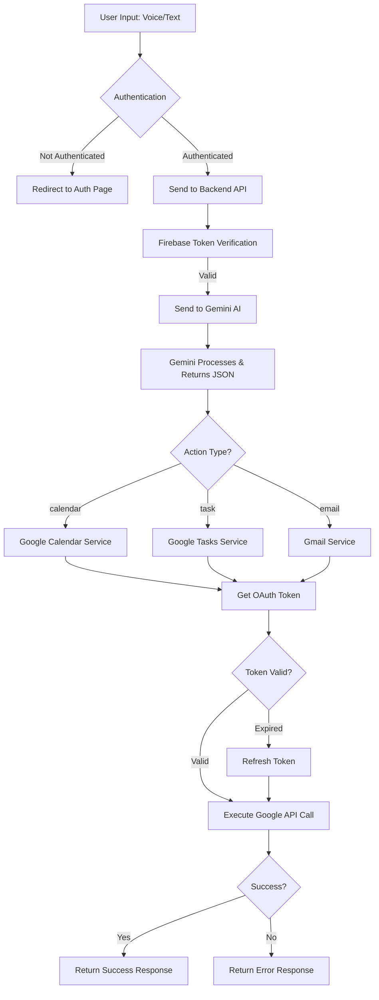

<div align="center">

# 🎤 Voice Audit

**An AI-Powered Voice Assistant for Seamless Google Workspace Integration**

*Transform your voice commands into calendar events, tasks, and emails with the power of Gemini AI*

[](https://react.dev/)
[](https://www.typescriptlang.org/)
[](https://nodejs.org/)
[](https://firebase.google.com/)
[](https://ai.google.dev/)
[](https://expressjs.com/)

[🚀 Quick Start](#-quick-start) • [✨ Features](#-features) • [📖 Setup](#-setup-guide) • [📚 API Docs](#-api-documentation) • [🤝 Contributing](#-contributing)

---

</div>

## 📖 Table of Contents

<details>
<summary>Click to expand</summary>

- [About](#-about-voice-audit)
- [Features](#-features)
- [Tech Stack](#-tech-stack)
- [Quick Start](#-quick-start)
- [Setup Guide](#-setup-guide)
- [Architecture](#-architecture--flow)
- [Project Structure](#-project-structure)
- [API Documentation](#-api-documentation)
- [Usage Examples](#-usage-examples)
- [Deployment](#-deployment)
- [Troubleshooting](#-troubleshooting)
- [Contributing](#-contributing)

</details>

---

## 🎯 About Voice Audit

**Voice Audit** is an intelligent voice assistant that bridges natural language and Google Workspace. Simply speak or type commands, and watch as the AI automatically creates calendar events, manages tasks, or sends emails.

### Key Highlights

- 🎙️ **Voice & Text Input** - Natural language processing
- 🤖 **AI-Powered** - Google Gemini AI understands context and intent
- 📅 **Calendar Integration** - Auto-schedule meetings and events
- ✅ **Task Management** - Create and organize tasks effortlessly
- 📧 **Email Automation** - Send emails with voice commands
- 🔐 **Secure** - Firebase Auth with Google OAuth 2.0
- 💾 **Persistent** - Firestore stores chat history
- 🎨 **Modern UI** - Beautiful, responsive design with glassmorphism

---

## ✨ Features

<details>
<summary><b>🎤 Voice & Text Processing</b></summary>

- Multi-input support (voice recording or text)
- Chrome Extension integration
- Web Speech API for real-time transcription
- Natural language understanding

</details>

<details>
<summary><b>🤖 AI-Powered Intelligence</b></summary>

- Gemini 2.5 Flash integration
- Context awareness (dates, times, locations, priorities)
- Automatic action detection (Calendar/Tasks/Email)
- Smart data extraction from unstructured input

</details>

<details>
<summary><b>📅 Google Workspace Integration</b></summary>

- **Calendar**: Create events with natural language ("Schedule meeting tomorrow at 2pm")
- **Tasks**: Manage tasks with priorities and due dates
- **Gmail**: Send emails via voice commands

</details>

---

## 🛠️ Tech Stack

| Frontend | Backend | Services |
|----------|---------|----------|
| React 19.2.0 | Node.js 18+ | Google Gemini AI |
| TypeScript 5.9.3 | Express 5.2.1 | Google Calendar API |
| Vite 7.2.4 | Firebase Admin | Google Tasks API |
| Firebase 12.7.0 | Google APIs | Gmail API |

---

## 🚀 Quick Start

### Prerequisites

- Node.js (v18+)
- Firebase Account
- Google Cloud Account
- Gemini API Key

### Installation

```bash
# Clone repository
git clone https://github.com/Rachitneema03/Voice-Audit.git
cd Voice-Audit

# Install frontend dependencies
cd frontend/Voice-audit
npm install

# Install backend dependencies
cd ../../backend
npm install
```

### Environment Setup

**Backend** (`backend/.env`):
```env
PORT=5000
GEMINI_API_KEY=your_gemini_api_key
GOOGLE_CLIENT_ID=your_client_id
GOOGLE_CLIENT_SECRET=your_client_secret
GOOGLE_REDIRECT_URI=http://localhost:5000/api/auth/google/callback
FIREBASE_SERVICE_ACCOUNT_PATH=./serviceAccount.json
```

**Frontend** (`frontend/Voice-audit/.env`):
```env
VITE_API_BASE_URL=http://localhost:5000
```

### Run

```bash
# Terminal 1: Start backend
cd backend
npm run dev

# Terminal 2: Start frontend
cd frontend/Voice-audit
npm run dev
```

Visit `http://localhost:5173` 🎉

---

## ⚙️ Setup Guide

<details>
<summary><b>📋 Detailed Setup Instructions</b></summary>

### 1. Firebase Configuration

1. Create project at [Firebase Console](https://console.firebase.google.com/)
2. Enable **Authentication** → Email/Password & Google
3. Enable **Firestore Database** (test mode for dev)
4. Get service account: **Project Settings** → **Service Accounts** → Download JSON
5. Place `serviceAccount.json` in `backend/` directory

**Frontend Config** (`frontend/Voice-audit/src/firebase/firebaseConfig.ts`):
```typescript
const firebaseConfig = {
  apiKey: "YOUR_API_KEY",
  authDomain: "YOUR_AUTH_DOMAIN",
  projectId: "YOUR_PROJECT_ID",
  // ... other config
};
```

### 2. Gemini API Setup

1. Go to [Google AI Studio](https://makersuite.google.com/app/apikey)
2. Create API key
3. Add to `backend/.env`: `GEMINI_API_KEY=your_key`

### 3. Google OAuth 2.0 Setup

1. **Google Cloud Console** → Create/Select project
2. **Enable APIs**:
   - [Calendar API](https://console.cloud.google.com/apis/library/calendar-json.googleapis.com)
   - [Tasks API](https://console.cloud.google.com/apis/library/tasks.googleapis.com)
   - [Gmail API](https://console.cloud.google.com/apis/library/gmail.googleapis.com)
3. **OAuth Consent Screen**:
   - External user type
   - Add scopes:
     - `https://www.googleapis.com/auth/calendar`
     - `https://www.googleapis.com/auth/tasks`
     - `https://www.googleapis.com/auth/gmail.send`
4. **Create OAuth Credentials**:
   - Web application
   - Redirect URI: `http://localhost:5000/api/auth/google/callback`
   - Copy Client ID & Secret to `.env`

</details>

---

## 🏗️ Architecture & Flow

```
┌─────────────────────────────────────────────────────────────┐
│                        User Interface                        │
│  ┌──────────────┐  ┌──────────────┐  ┌──────────────┐    │
│  │ Landing Page │  │  Auth Page    │  │  Chat Page   │    │
│  └──────────────┘  └──────────────┘  └──────────────┘    │
└─────────────────────────────────────────────────────────────┘
                            │
                            ▼
┌─────────────────────────────────────────────────────────────┐
│                    Frontend (React + Vite)                    │
│  ┌──────────────┐  ┌──────────────┐  ┌──────────────┐    │
│  │ Firebase     │  │ API Service  │  │ Firestore    │    │
│  │ Auth         │  │              │  │ Service      │    │
│  └──────────────┘  └──────────────┘  └──────────────┘    │
└─────────────────────────────────────────────────────────────┘
                            │
                            │ HTTP/REST API
                            ▼
┌─────────────────────────────────────────────────────────────┐
│              Backend (Node.js + Express + TypeScript)        │
│  ┌──────────────┐  ┌──────────────┐  ┌──────────────┐    │
│  │ Gemini       │  │ Google OAuth │  │ Calendar     │    │
│  │ Service      │  │ Service      │  │ Tasks        │    │
│  └──────────────┘  └──────────────┘  └──────────────┘    │
└─────────────────────────────────────────────────────────────┘
                            │
                            ▼
┌─────────────────────────────────────────────────────────────┐
│                    External Services                         │
│  ┌──────────────┐  ┌──────────────┐  ┌──────────────┐    │
│  │ Google       │  │ Google       │  │ Gmail API    │    │
│  │ Gemini AI    │  │ Calendar API │  │ Firestore    │    │
│  └──────────────┘  └──────────────┘  └──────────────┘    │
└─────────────────────────────────────────────────────────────┘
```

### Application Flow



---

## 📁 Project Structure

<details>
<summary><b>📂 View Project Structure</b></summary>

```
Voice-Audit/
├── backend/
│   ├── src/
│   │   ├── index.ts                  # Main server entry
│   │   ├── routes/                   # API routes
│   │   ├── services/                  # Business logic
│   │   └── middlewares/               # Express middlewares
│   ├── serviceAccount.json            # Firebase service account
│   └── .env                           # Environment variables
│
├── frontend/Voice-audit/
│   ├── src/
│   │   ├── pages/                     # Page components
│   │   ├── contexts/                  # React contexts
│   │   ├── firebase/                  # Firebase config
│   │   ├── services/                  # API services
│   │   └── App.tsx                    # Main app
│   └── .env                           # Frontend env vars
│
└── README.md
```

</details>

---

## 📚 API Documentation

### Base URL
- **Development**: `http://localhost:5000`
- **Production**: Your deployed backend URL

### Authentication
All protected endpoints require Firebase ID token:
```
Authorization: Bearer <firebase_id_token>
```

### Endpoints

<details>
<summary><b>GET /health</b> - Health Check</summary>

**Response:**
```json
{
  "status": "ok",
  "message": "Backend is running"
}
```

</details>

<details>
<summary><b>POST /api/process</b> - Process Text</summary>

**Request:**
```json
{
  "text": "Schedule a meeting tomorrow at 2pm"
}
```

**Response (Success):**
```json
{
  "success": true,
  "action": "calendar",
  "message": "Calendar event created successfully",
  "data": {
    "id": "event_id_123",
    "title": "Meeting",
    "start": "2024-01-15T14:00:00Z",
    "end": "2024-01-15T15:00:00Z"
  }
}
```

**Response (Error):**
```json
{
  "success": false,
  "action": "unknown",
  "message": "Could not determine the action from the input."
}
```

</details>

<details>
<summary><b>GET /api/auth/google/url</b> - Get OAuth URL</summary>

**Response:**
```json
{
  "success": true,
  "authUrl": "https://accounts.google.com/o/oauth2/v2/auth?..."
}
```

</details>

<details>
<summary><b>GET /api/user/google-status</b> - Check Google Connection</summary>

**Response:**
```json
{
  "connected": true
}
```

</details>

---

## 💡 Usage Examples

<details>
<summary><b>📅 Example 1: Create Calendar Event</b></summary>

**Input:** `"Schedule a team meeting tomorrow at 3pm for 1 hour"`

**Process:**
1. Gemini extracts: action=`calendar`, title="Team meeting", date=tomorrow, time="15:00", duration=60min
2. Backend creates Google Calendar event
3. Returns success with event details

</details>

<details>
<summary><b>✅ Example 2: Create Task</b></summary>

**Input:** `"Remind me to buy groceries this weekend"`

**Process:**
1. Gemini extracts: action=`task`, title="Buy groceries", due date=weekend
2. Backend creates Google Task
3. Task appears in Google Tasks

</details>

<details>
<summary><b>📧 Example 3: Send Email</b></summary>

**Input:** `"Send an email to john@example.com about the project update"`

**Process:**
1. Gemini extracts: action=`email`, recipient="john@example.com", subject="Project Update"
2. Backend sends email via Gmail API
3. Email sent successfully

</details>

<details>
<summary><b>🎤 Example 4: Voice Command</b></summary>

1. Click and hold microphone button
2. Speak: "Schedule dentist appointment next Friday at 10am"
3. Release button → Voice converted to text
4. Processed like Example 1 → Calendar event created

</details>

---

## 🚀 Deployment

<details>
<summary><b>Frontend: Firebase Hosting</b></summary>

```bash
cd frontend/Voice-audit
npm install -g firebase-tools
firebase login
firebase init hosting
npm run build
firebase deploy --only hosting
```

</details>

<details>
<summary><b>Backend: Vercel / Railway / Render</b></summary>

**Vercel:**
```bash
cd backend
npm install -g vercel
npm run build
vercel
```

**Railway / Render:**
1. Connect GitHub repository
2. Set root directory: `backend`
3. Add environment variables
4. Deploy

**Environment Variables:**
- `GEMINI_API_KEY`
- `GOOGLE_CLIENT_ID`
- `GOOGLE_CLIENT_SECRET`
- `GOOGLE_REDIRECT_URI` (update to production URL)
- `FIREBASE_SERVICE_ACCOUNT` (as JSON string)

</details>

---

## 🐛 Troubleshooting

<details>
<summary><b>Backend Not Starting</b></summary>

- Check all environment variables in `.env`
- Verify `serviceAccount.json` exists and is valid
- Ensure port 5000 is not in use
- Check Node.js version (requires v18+)

</details>

<details>
<summary><b>Firebase Authentication Issues</b></summary>

- Verify Firebase configuration in `firebaseConfig.ts`
- Check authentication methods enabled in Firebase Console
- Ensure Firebase project is active
- Check browser console for errors

</details>

<details>
<summary><b>Google OAuth Not Working</b></summary>

- Verify OAuth credentials in Google Cloud Console
- Check redirect URI matches exactly (including http/https)
- Ensure all three APIs are enabled (Calendar, Tasks, Gmail)
- Add your email as test user (if in testing mode)

</details>

<details>
<summary><b>Gemini API Errors</b></summary>

- Verify `GEMINI_API_KEY` is set correctly
- Check API key is active in Google AI Studio
- Ensure API key has proper permissions
- Check API quota limits

</details>

<details>
<summary><b>Frontend Can't Connect to Backend</b></summary>

- Verify backend is running on correct port
- Check `VITE_API_BASE_URL` in frontend `.env`
- Ensure CORS is enabled in backend
- Test backend health: `http://localhost:5000/health`

</details>

---

## 🤝 Contributing

We welcome contributions! Here's how:

1. **Fork the repository**
2. **Create a feature branch**
   ```bash
   git checkout -b feature/AmazingFeature
   ```
3. **Make your changes** (follow code style, add comments)
4. **Commit and push**
   ```bash
   git commit -m 'Add some AmazingFeature'
   git push origin feature/AmazingFeature
   ```
5. **Open a Pull Request** with clear description

### Code Style
- Use TypeScript for type safety
- Follow ESLint rules
- Add JSDoc comments for functions
- Keep functions small and focused

### Reporting Issues
Include: description, steps to reproduce, expected vs actual behavior, screenshots, environment details.

---

## 👥 Contributors

<table>
<tr>
<td align="center">
<a href="https://github.com/Rachitneema03">

<br />
<sub><b>Rachit Neema</b></sub>
</a>
<br />
Frontend + UI
</td>
<td align="center">
<a href="https://github.com/yashvyas101">

<br />
<sub><b>Yash Vyas</b></sub>
</a>
<br />
Backend, Database, Security
</td>
<td align="center">
<a href="https://github.com">

<br />
<sub><b>Sumadha Mandlo</b></sub>
</a>
<br />
UI Design
</td>
<td align="center">
<a href="https://github.com">

<br />
<sub><b>Nitika Jain</b></sub>
</a>
<br />
Frontend Development
</td>
</tr>
</table>

---

## 📄 License

This project is licensed under the **ISC License**.

---

## 🙏 Acknowledgments

- [React](https://react.dev/) - UI library
- [Firebase](https://firebase.google.com/) - Backend infrastructure
- [Google Gemini AI](https://ai.google.dev/) - Natural language processing
- [Vite](https://vite.dev/) - Build tool
- [TypeScript](https://www.typescriptlang.org/) - Type safety
- [Express](https://expressjs.com/) - Web framework
- [Google APIs](https://developers.google.com/) - Workspace integration

---

## 📞 Support

- 🐛 **Bug Reports**: [GitHub Issues](https://github.com/Rachitneema03/Voice-Audit/issues)
- 💬 **Discussions**: [GitHub Discussions](https://github.com/Rachitneema03/Voice-Audit/discussions)
- 📖 **Detailed Setup**: Check [SETUP.md](./backend/SETUP.md)

---

<div align="center">

**Made with ❤️ by the Voice Audit Team**

[](https://github.com/Rachitneema03/Voice-Audit/stargazers)
[](https://github.com/Rachitneema03/Voice-Audit/network/members)
[](https://github.com/Rachitneema03/Voice-Audit/issues)

⭐ **Star this repo if you find it helpful!**

</div>
