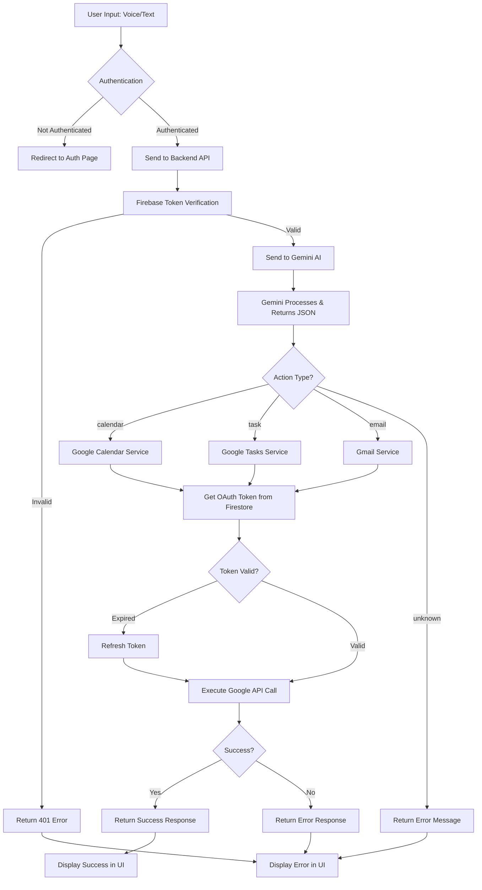

<div align="center">

# 🎤 Voice Audit

**An AI-Powered Voice Assistant for Seamless Google Workspace Integration**

*Transform your voice commands into calendar events, tasks, and emails with the power of Gemini AI*

[](https://react.dev/)
[](https://www.typescriptlang.org/)
[](https://nodejs.org/)
[](https://firebase.google.com/)
[](https://ai.google.dev/)
[](https://expressjs.com/)

[Features](#-features) • [Installation](#-installation) • [Setup](#-setup) • [Usage](#-usage) • [API Docs](#-api-documentation) • [Contributing](#-contributing)

---

</div>

## 📖 Table of Contents

- [About](#-about-voice-audit)
- [Features](#-features)
- [Tech Stack](#-tech-stack)
- [Architecture](#-architecture--flow)
- [Installation](#-installation)
- [Setup Guide](#-setup-guide)
- [Project Structure](#-project-structure)
- [API Documentation](#-api-documentation)
- [Usage Examples](#-usage-examples)
- [Deployment](#-deployment)
- [Contributing](#-contributing)
- [Troubleshooting](#-troubleshooting)
- [License](#-license)

---

## 🎯 About Voice Audit

**Voice Audit** is an intelligent voice assistant web application that bridges the gap between natural language and Google Workspace productivity tools. Simply speak or type your commands, and watch as the AI-powered system automatically creates calendar events, manages tasks, or sends emails on your behalf.

### Key Highlights

- 🎙️ **Voice & Text Input** - Use your voice or type commands naturally
- 🤖 **AI-Powered Processing** - Google Gemini AI understands context and intent
- 📅 **Calendar Integration** - Automatically schedule meetings and events
- ✅ **Task Management** - Create and organize tasks effortlessly
- 📧 **Email Automation** - Send emails with voice commands
- 🔐 **Secure Authentication** - Firebase Auth with Google OAuth 2.0
- 💾 **Data Persistence** - Firestore stores your chat history and preferences
- 🎨 **Modern UI/UX** - Beautiful, responsive design with glassmorphism effects

---

## ✨ Features

### 🎤 Voice & Text Processing
- **Multi-input Support**: Voice recording via browser MediaRecorder API or text input
- **Chrome Extension**: Seamless voice-to-text conversion from browser
- **Web Speech API**: Built-in speech recognition for real-time transcription
- **Natural Language Understanding**: Process commands in conversational language

### 🤖 AI-Powered Intelligence
- **Gemini 2.5 Flash Integration**: Advanced natural language processing
- **Context Awareness**: Understands dates, times, locations, and priorities
- **Action Detection**: Automatically determines if command is for Calendar, Tasks, or Email
- **Smart Parsing**: Extracts structured data from unstructured input

### 📅 Google Calendar Integration
- **Event Creation**: "Schedule a meeting tomorrow at 2pm" → Creates calendar event
- **Date Parsing**: Understands relative dates (tomorrow, next Monday, etc.)
- **Time Management**: Automatic duration calculation and time zone handling
- **Location Support**: Add locations to events from voice commands

### ✅ Google Tasks Integration
- **Task Creation**: "Remind me to buy groceries" → Creates task
- **Priority Levels**: Automatically assigns priority (low, medium, high)
- **Due Date Management**: Understands and sets due dates from commands
- **Task Organization**: Seamless integration with Google Tasks

### 📧 Gmail Integration
- **Email Sending**: "Send email to john@example.com about the meeting" → Sends email
- **Subject & Body Extraction**: AI extracts email content from commands
- **Recipient Detection**: Automatically identifies email addresses
- **Secure Sending**: Uses Gmail API with OAuth 2.0 authentication

### 🔐 Authentication & Security
- **Firebase Authentication**: Secure email/password and Google sign-in
- **OAuth 2.0 Flow**: Secure Google Workspace integration
- **Token Management**: Automatic token refresh and secure storage
- **Protected Routes**: Authentication required for all features
- **Firestore Security**: Secure data storage with Firebase rules

### 💬 Chat Interface
- **Real-time Chat**: Interactive chat interface with message history
- **Chat Persistence**: All conversations saved in Firestore
- **Multiple Chats**: Create and manage multiple conversation threads
- **Message Timestamps**: Track when messages were sent
- **User Profiles**: Manage your profile and preferences

### 🎨 User Experience
- **Modern Design**: Glassmorphism effects with dark theme
- **Responsive Layout**: Works seamlessly on desktop, tablet, and mobile
- **Smooth Animations**: Beautiful transitions and hover effects
- **Loading States**: Visual feedback during processing
- **Error Handling**: User-friendly error messages and recovery

---

## 🛠️ Tech Stack

### Frontend
| Technology | Version | Purpose |
|------------|---------|---------|
| **React** | 19.2.0 | UI Framework |
| **TypeScript** | 5.9.3 | Type Safety |
| **Vite** | 7.2.4 | Build Tool & Dev Server |
| **React Router** | 7.11.0 | Client-side Routing |
| **Firebase** | 12.7.0 | Authentication & Firestore |
| **Bootstrap Icons** | 1.13.1 | Icon Library |

### Backend
| Technology | Version | Purpose |
|------------|---------|---------|
| **Node.js** | 18+ | Runtime Environment |
| **Express** | 5.2.1 | Web Framework |
| **TypeScript** | 5.3.3 | Type Safety |
| **Firebase Admin** | 13.6.0 | Server-side Firebase |
| **Google APIs** | 169.0.0 | Calendar, Tasks, Gmail |
| **Gemini AI** | 0.24.1 | Natural Language Processing |

### Services & APIs
- **Google Gemini AI** - Natural language understanding
- **Google Calendar API** - Event management
- **Google Tasks API** - Task creation and management
- **Gmail API** - Email sending
- **Firebase Authentication** - User authentication
- **Cloud Firestore** - Data persistence

---

## 🏗️ Architecture & Flow

### System Architecture

```
┌─────────────────────────────────────────────────────────────┐
│                        User Interface                        │
│  ┌──────────────┐  ┌──────────────┐  ┌──────────────┐    │
│  │ Landing Page │  │  Auth Page    │  │  Chat Page   │    │
│  └──────────────┘  └──────────────┘  └──────────────┘    │
└─────────────────────────────────────────────────────────────┘
                            │
                            ▼
┌─────────────────────────────────────────────────────────────┐
│                    Frontend (React + Vite)                    │
│  ┌──────────────┐  ┌──────────────┐  ┌──────────────┐    │
│  │ Firebase     │  │ API Service  │  │ Firestore    │    │
│  │ Auth         │  │              │  │ Service      │    │
│  └──────────────┘  └──────────────┘  └──────────────┘    │
└─────────────────────────────────────────────────────────────┘
                            │
                            │ HTTP/REST API
                            ▼
┌─────────────────────────────────────────────────────────────┐
│              Backend (Node.js + Express + TypeScript)        │
│  ┌──────────────┐  ┌──────────────┐  ┌──────────────┐    │
│  │ Firebase     │  │ Gemini       │  │ Google OAuth │    │
│  │ Admin        │  │ Service      │  │ Service      │    │
│  └──────────────┘  └──────────────┘  └──────────────┘    │
│  ┌──────────────┐  ┌──────────────┐  ┌──────────────┐    │
│  │ Calendar     │  │ Tasks        │  │ Gmail        │    │
│  │ Service      │  │ Service      │  │ Service      │    │
│  └──────────────┘  └──────────────┘  └──────────────┘    │
└─────────────────────────────────────────────────────────────┘
                            │
                            ▼
┌─────────────────────────────────────────────────────────────┐
│                    External Services                         │
│  ┌──────────────┐  ┌──────────────┐  ┌──────────────┐    │
│  │ Google       │  │ Google       │  │ Google       │    │
│  │ Gemini AI    │  │ Calendar API │  │ Tasks API    │    │
│  └──────────────┘  └──────────────┘  └──────────────┘    │
│  ┌──────────────┐  ┌──────────────┐                       │
│  │ Gmail API    │  │ Firestore    │                       │
│  └──────────────┘  └──────────────┘                       │
└─────────────────────────────────────────────────────────────┘
```

### Application Flow



---

## 📦 Installation

### Prerequisites

Before you begin, ensure you have the following installed:

- **Node.js** (v18 or higher) - [Download](https://nodejs.org/)
- **npm** (comes with Node.js) or **yarn**
- **Git** - [Download](https://git-scm.com/)
- **Firebase Account** - [Sign up](https://firebase.google.com/)
- **Google Cloud Account** - [Sign up](https://cloud.google.com/)

### Clone the Repository

```bash
git clone https://github.com/Rachitneema03/Voice-Audit.git
cd Voice-Audit
```

---

## ⚙️ Setup Guide

### 1. Frontend Setup

```bash
# Navigate to frontend directory
cd frontend/Voice-audit

# Install dependencies
npm install

# Create environment file
# Create .env file with:
# VITE_API_BASE_URL=http://localhost:5000
```

### 2. Backend Setup

```bash
# Navigate to backend directory
cd backend

# Install dependencies
npm install

# Create .env file (see Environment Variables section)
```

### 3. Firebase Configuration

#### Step 1: Create Firebase Project

1. Go to [Firebase Console](https://console.firebase.google.com/)
2. Click "Add project" and follow the setup wizard
3. Enable Google Analytics (optional)

#### Step 2: Configure Frontend Firebase

1. In Firebase Console, click the web icon (`</>`)
2. Register your app with a nickname
3. Copy your Firebase configuration
4. Update `frontend/Voice-audit/src/firebase/firebaseConfig.ts`:

```typescript
const firebaseConfig = {
  apiKey: "YOUR_API_KEY",
  authDomain: "YOUR_AUTH_DOMAIN",
  projectId: "YOUR_PROJECT_ID",
  storageBucket: "YOUR_STORAGE_BUCKET",
  messagingSenderId: "YOUR_MESSAGING_SENDER_ID",
  appId: "YOUR_APP_ID",
  measurementId: "YOUR_MEASUREMENT_ID"
};
```

#### Step 3: Enable Authentication

1. Go to **Authentication** → **Sign-in method**
2. Enable **Email/Password**
3. Enable **Google** provider

#### Step 4: Enable Firestore

1. Go to **Firestore Database** → **Create database**
2. Start in **test mode** (for development)
3. Choose a location

#### Step 5: Get Service Account (Backend)

1. Go to **Project Settings** → **Service Accounts**
2. Click **Generate new private key**
3. Download JSON file
4. Rename to `serviceAccount.json` and place in `backend/` directory
5. **Important**: Add to `.gitignore` (already included)

### 4. Gemini API Setup

1. Go to [Google AI Studio](https://makersuite.google.com/app/apikey)
2. Sign in with your Google account
3. Click **Create API Key**
4. Copy the API key
5. Add to backend `.env` file:

```env
GEMINI_API_KEY=your_api_key_here
```

### 5. Google OAuth 2.0 Setup

#### Step 1: Create Google Cloud Project

1. Go to [Google Cloud Console](https://console.cloud.google.com/)
2. Create a new project or select existing
3. Note your project ID

#### Step 2: Enable Required APIs

Enable these APIs in Google Cloud Console:

- **Google Calendar API** - [Enable](https://console.cloud.google.com/apis/library/calendar-json.googleapis.com)
- **Google Tasks API** - [Enable](https://console.cloud.google.com/apis/library/tasks.googleapis.com)
- **Gmail API** - [Enable](https://console.cloud.google.com/apis/library/gmail.googleapis.com)

#### Step 3: Configure OAuth Consent Screen

1. Go to **APIs & Services** → **OAuth consent screen**
2. Choose **External** user type
3. Fill in app information:
   - App name: "Voice Audit"
   - User support email: Your email
   - Developer contact: Your email
4. **Add Scopes**:
   - `https://www.googleapis.com/auth/calendar`
   - `https://www.googleapis.com/auth/tasks`
   - `https://www.googleapis.com/auth/gmail.send`
5. Add test users (for testing mode)
6. Save and continue

#### Step 4: Create OAuth Credentials

1. Go to **APIs & Services** → **Credentials**
2. Click **Create Credentials** → **OAuth client ID**
3. Choose **Web application**
4. Configure:
   - Name: "Voice Audit Backend"
   - Authorized redirect URIs:
     - `http://localhost:5000/api/auth/google/callback` (development)
     - Add production URL when deploying
5. Click **Create**
6. Copy **Client ID** and **Client Secret**

### 6. Environment Variables

#### Backend `.env` File

Create `backend/.env`:

```env
# Server Configuration
PORT=5000
NODE_ENV=development

# Firebase
FIREBASE_SERVICE_ACCOUNT_PATH=./serviceAccount.json
# OR use JSON string:
# FIREBASE_SERVICE_ACCOUNT={"type":"service_account",...}

# Gemini API
GEMINI_API_KEY=your_gemini_api_key_here

# Google OAuth 2.0
GOOGLE_CLIENT_ID=your_google_client_id
GOOGLE_CLIENT_SECRET=your_google_client_secret
GOOGLE_REDIRECT_URI=http://localhost:5000/api/auth/google/callback
```

#### Frontend `.env` File

Create `frontend/Voice-audit/.env`:

```env
VITE_API_BASE_URL=http://localhost:5000
```

For production, update with your backend URL.

### 7. Run the Application

#### Start Backend

```bash
cd backend
npm run dev
```

Backend will run on `http://localhost:5000`

#### Start Frontend

```bash
cd frontend/Voice-audit
npm run dev
```

Frontend will run on `http://localhost:5173` (or port assigned by Vite)

---

## 📁 Project Structure

```
Voice-Audit/
├── backend/                          # Backend server
│   ├── src/
│   │   ├── index.ts                  # Main server entry point
│   │   ├── firebaseAdmin.ts          # Firebase Admin initialization
│   │   ├── routes/                   # API routes
│   │   │   ├── audio.route.ts        # Text processing endpoint
│   │   │   ├── auth.route.ts        # OAuth endpoints
│   │   │   ├── user.route.ts        # User status endpoints
│   │   │   └── gemini.route.ts      # Gemini test endpoint
│   │   ├── services/                 # Business logic services
│   │   │   ├── gemini.service.ts     # Gemini AI integration
│   │   │   ├── googleOAuth.service.ts    # OAuth token management
│   │   │   ├── googleCalendar.service.ts  # Calendar API
│   │   │   ├── googleTasks.service.ts    # Tasks API
│   │   │   ├── googleGmail.service.ts    # Gmail API
│   │   │   └── actionRouter.service.ts   # Action routing logic
│   │   └── middlewares/              # Express middlewares
│   │       └── firebaseAuth.ts       # Firebase token verification
│   ├── dist/                         # Compiled JavaScript (generated)
│   ├── tsconfig.json                 # TypeScript configuration
│   ├── package.json                  # Dependencies
│   ├── SETUP.md                      # Detailed setup guide
│   ├── FLOWCHART.md                  # Flow diagrams
│   └── README.md                     # Backend documentation
│
├── frontend/
│   └── Voice-audit/                  # React frontend application
│       ├── src/
│       │   ├── pages/                 # Page components
│       │   │   ├── LandingPage.tsx   # Landing page
│       │   │   ├── AuthPage.tsx      # Authentication page
│       │   │   └── ChatPage.tsx      # Main chat interface
│       │   ├── contexts/              # React contexts
│       │   │   └── AuthContext.tsx    # Authentication context
│       │   ├── firebase/              # Firebase configuration
│       │   │   ├── firebaseConfig.ts  # Firebase app config
│       │   │   ├── auth.ts           # Auth service
│       │   │   ├── firestore.ts      # Firestore service
│       │   │   └── storage.ts        # Storage service
│       │   ├── services/              # API and utility services
│       │   │   ├── api.service.ts    # Backend API calls
│       │   │   ├── firestore.service.ts  # Firestore operations
│       │   │   └── chromeExtension.service.ts  # Extension integration
│       │   ├── config/               # Configuration files
│       │   │   └── api.config.ts     # API endpoints config
│       │   ├── utils/                # Utility functions
│       │   │   └── imageCompression.ts  # Image compression
│       │   ├── App.tsx               # Main app component
│       │   ├── main.tsx               # Application entry point
│       │   └── index.css              # Global styles
│       ├── public/                    # Static assets
│       │   ├── logo3.png              # Application logo
│       │   └── background.png         # Background image
│       ├── package.json               # Dependencies
│       ├── vite.config.ts             # Vite configuration
│       ├── tsconfig.json              # TypeScript configuration
│       └── README.md                   # Frontend documentation
│
└── README.md                          # This file
```

---

## 📚 API Documentation

### Base URL

- **Development**: `http://localhost:5000`
- **Production**: Your deployed backend URL

### Authentication

All protected endpoints require a Firebase ID token in the Authorization header:

```
Authorization: Bearer <firebase_id_token>
```

### Endpoints

#### Health Check

```http
GET /health
```

**Response:**
```json
{
  "status": "ok",
  "message": "Backend is running"
}
```

---

#### Process Text

Process user input and execute action (Calendar/Task/Email).

```http
POST /api/process
```

**Headers:**
```
Authorization: Bearer <firebase_id_token>
Content-Type: application/json
```

**Request Body:**
```json
{
  "text": "Schedule a meeting tomorrow at 2pm"
}
```

**Response (Success):**
```json
{
  "success": true,
  "action": "calendar",
  "message": "Calendar event created successfully",
  "data": {
    "id": "event_id_123",
    "title": "Meeting",
    "start": "2024-01-15T14:00:00Z",
    "end": "2024-01-15T15:00:00Z"
  }
}
```

**Response (Error):**
```json
{
  "success": false,
  "action": "unknown",
  "message": "Could not determine the action from the input."
}
```

---

#### Get Google OAuth URL

Get authorization URL for Google OAuth flow.

```http
GET /api/auth/google/url
```

**Headers:**
```
Authorization: Bearer <firebase_id_token>
```

**Response:**
```json
{
  "success": true,
  "authUrl": "https://accounts.google.com/o/oauth2/v2/auth?..."
}
```

---

#### Google OAuth Callback

OAuth callback endpoint (handled automatically by Google).

```http
GET /api/auth/google/callback?code=<authorization_code>&state=<user_id>
```

This endpoint is called by Google after user authorization. It stores tokens in Firestore and returns an HTML page that closes the popup.

---

#### Check Google Connection Status

Check if user has connected their Google account.

```http
GET /api/user/google-status
```

**Headers:**
```
Authorization: Bearer <firebase_id_token>
```

**Response:**
```json
{
  "connected": true
}
```

---

#### Test Gemini API

Test endpoint for Gemini API (development only).

```http
POST /api/gemini/test
```

**Headers:**
```
Authorization: Bearer <firebase_id_token>
Content-Type: application/json
```

**Request Body:**
```json
{
  "text": "Schedule a meeting tomorrow"
}
```

---

## 💡 Usage Examples

### Example 1: Create Calendar Event

**Input:**
```
"Schedule a team meeting tomorrow at 3pm for 1 hour"
```

**What Happens:**
1. Text sent to backend
2. Gemini AI processes and extracts:
   - Action: `calendar`
   - Title: "Team meeting"
   - Date: Tomorrow's date
   - Time: "15:00"
   - Duration: 60 minutes
3. Backend creates Google Calendar event
4. Returns success with event details

---

### Example 2: Create Task

**Input:**
```
"Remind me to buy groceries this weekend"
```

**What Happens:**
1. Gemini extracts:
   - Action: `task`
   - Title: "Buy groceries"
   - Due Date: This weekend
   - Priority: Medium (default)
2. Backend creates Google Task
3. Task appears in your Google Tasks

---

### Example 3: Send Email

**Input:**
```
"Send an email to john@example.com about the project update"
```

**What Happens:**
1. Gemini extracts:
   - Action: `email`
   - Recipient: "john@example.com"
   - Subject: "Project Update"
   - Body: Generated from context
2. Backend sends email via Gmail API
3. Email is sent successfully

---

### Example 4: Voice Command

1. Click and hold the microphone button
2. Speak: "Schedule dentist appointment next Friday at 10am"
3. Release button
4. Voice is converted to text
5. Text is processed like Example 1
6. Calendar event is created

---

## 🚀 Deployment

### Frontend Deployment (Firebase Hosting)

```bash
cd frontend/Voice-audit

# Install Firebase CLI (if not installed)
npm install -g firebase-tools

# Login to Firebase
firebase login

# Initialize Firebase Hosting
firebase init hosting

# Build frontend
npm run build

# Deploy
firebase deploy --only hosting
```

### Backend Deployment Options

#### Option 1: Vercel (Recommended)

```bash
cd backend

# Install Vercel CLI
npm install -g vercel

# Build backend
npm run build

# Deploy
vercel
```

Set environment variables in Vercel dashboard.

#### Option 2: Railway

1. Go to [Railway](https://railway.app/)
2. Create new project
3. Connect GitHub repository
4. Set root directory: `backend`
5. Add environment variables
6. Deploy

#### Option 3: Render

1. Go to [Render](https://render.com/)
2. Create new Web Service
3. Connect repository
4. Set build command: `npm install && npm run build`
5. Set start command: `npm start`
6. Add environment variables
7. Deploy

### Environment Variables for Production

Update these in your deployment platform:

- `GEMINI_API_KEY`
- `GOOGLE_CLIENT_ID`
- `GOOGLE_CLIENT_SECRET`
- `GOOGLE_REDIRECT_URI` (update to production URL)
- `FIREBASE_SERVICE_ACCOUNT` (as JSON string)

**Important:** Update OAuth redirect URI in Google Cloud Console to match production URL.

---

## 🤝 Contributing

We welcome contributions! Please follow these steps:

### Contribution Guidelines

1. **Fork the repository**
2. **Create a feature branch**
   ```bash
   git checkout -b feature/AmazingFeature
   ```
3. **Make your changes**
   - Follow the existing code style
   - Add comments for complex logic
   - Update documentation if needed
4. **Commit your changes**
   ```bash
   git commit -m 'Add some AmazingFeature'
   ```
5. **Push to the branch**
   ```bash
   git push origin feature/AmazingFeature
   ```
6. **Open a Pull Request**
   - Provide a clear description
   - Reference any related issues
   - Add screenshots if UI changes

### Code Style

- Use TypeScript for type safety
- Follow ESLint rules
- Use meaningful variable names
- Add JSDoc comments for functions
- Keep functions small and focused

### Reporting Issues

When reporting issues, please include:
- Description of the problem
- Steps to reproduce
- Expected behavior
- Actual behavior
- Screenshots (if applicable)
- Environment details (OS, browser, Node version)

---

## 👥 Contributors

We are grateful to all contributors who have made this project possible:

<table>
<tr>
<td align="center">
<a href="https://github.com/Rachitneema03">

<br />
<sub><b>Rachit Nima</b></sub>
</a>
<br />
Frontend + UI
</td>
<td align="center">
<a href="https://github.com/yashvyas101">

<br />
<sub><b>Yash Vyas</b></sub>
</a>
<br />
Backend, Database, Security
</td>
<td align="center">
<a href="https://github.com">

<br />
<sub><b>Sumadha Mandlo</b></sub>
</a>
<br />
UI Design
</td>
<td align="center">
<a href="https://github.com">

<br />
<sub><b>Nitika Jain</b></sub>
</a>
<br />
Frontend Development
</td>
</tr>
</table>

**Contributors:**
- **Rachit Nima** - Frontend Development + UI/UX Design
- **Yash Vyas** - Backend Architecture, Database Design, Security Implementation
- **Sumadha Mandlo** - UI Design & User Experience
- **Nitika Jain** - Frontend Development & Component Architecture

---

## 🐛 Troubleshooting

### Common Issues

#### Backend Not Starting

**Problem:** Backend fails to start or crashes

**Solutions:**
1. Check all environment variables are set in `.env`
2. Verify `serviceAccount.json` exists and is valid
3. Ensure port 5000 is not in use
4. Check Node.js version (requires v18+)
5. Run `npm install` to ensure dependencies are installed

#### Firebase Authentication Not Working

**Problem:** Can't sign in or sign up

**Solutions:**
1. Verify Firebase configuration in `firebaseConfig.ts`
2. Check authentication methods are enabled in Firebase Console
3. Ensure Firebase project is active
4. Check browser console for error messages
5. Verify Firebase rules allow read/write

#### Google OAuth Not Working

**Problem:** Can't connect Google account

**Solutions:**
1. Verify OAuth credentials in Google Cloud Console
2. Check redirect URI matches exactly (including http/https)
3. Ensure all three APIs are enabled (Calendar, Tasks, Gmail)
4. Add your email as a test user (if in testing mode)
5. Check OAuth consent screen is configured
6. Verify scopes are added correctly

#### Gemini API Errors

**Problem:** Text processing fails

**Solutions:**
1. Verify `GEMINI_API_KEY` is set correctly
2. Check API key is active in Google AI Studio
3. Ensure API key has proper permissions
4. Check API quota limits
5. Verify network connectivity

#### Frontend Can't Connect to Backend

**Problem:** Frontend shows "Cannot connect to backend"

**Solutions:**
1. Verify backend is running on correct port
2. Check `VITE_API_BASE_URL` in frontend `.env`
3. Ensure CORS is enabled in backend
4. Check browser console for CORS errors
5. Verify backend health endpoint: `http://localhost:5000/health`

#### Voice Recording Not Working

**Problem:** Microphone not recording

**Solutions:**
1. Grant microphone permissions in browser
2. Use HTTPS in production (required for MediaRecorder)
3. Check browser compatibility
4. Verify microphone is connected and working
5. Try different browser (Chrome recommended)

---

## 📄 License

This project is licensed under the **ISC License**.

---

## 🙏 Acknowledgments

- [React](https://react.dev/) - Amazing UI library
- [Firebase](https://firebase.google.com/) - Backend infrastructure
- [Google Gemini AI](https://ai.google.dev/) - Natural language processing
- [Vite](https://vite.dev/) - Lightning-fast build tool
- [TypeScript](https://www.typescriptlang.org/) - Type safety
- [Express](https://expressjs.com/) - Web framework
- [Google APIs](https://developers.google.com/) - Calendar, Tasks, Gmail integration

---

## 📞 Support

If you need help or have questions:

- 📧 **Email**: Open an issue on GitHub
- 🐛 **Bug Reports**: [GitHub Issues](https://github.com/Rachitneema03/Voice-Audit/issues)
- 💬 **Discussions**: [GitHub Discussions](https://github.com/Rachitneema03/Voice-Audit/discussions)
- 📖 **Documentation**: Check the [SETUP.md](./backend/SETUP.md) for detailed setup

---

<div align="center">

**Made with ❤️ by the Voice Audit Team**

[](https://github.com/Rachitneema03/Voice-Audit/stargazers)
[](https://github.com/Rachitneema03/Voice-Audit/network/members)
[](https://github.com/Rachitneema03/Voice-Audit/issues)

⭐ Star this repo if you find it helpful!

</div>
