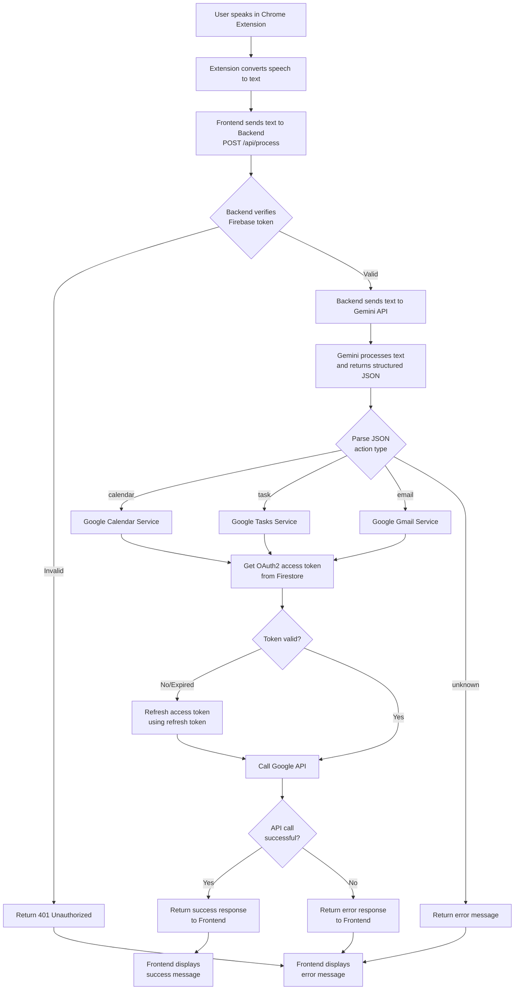
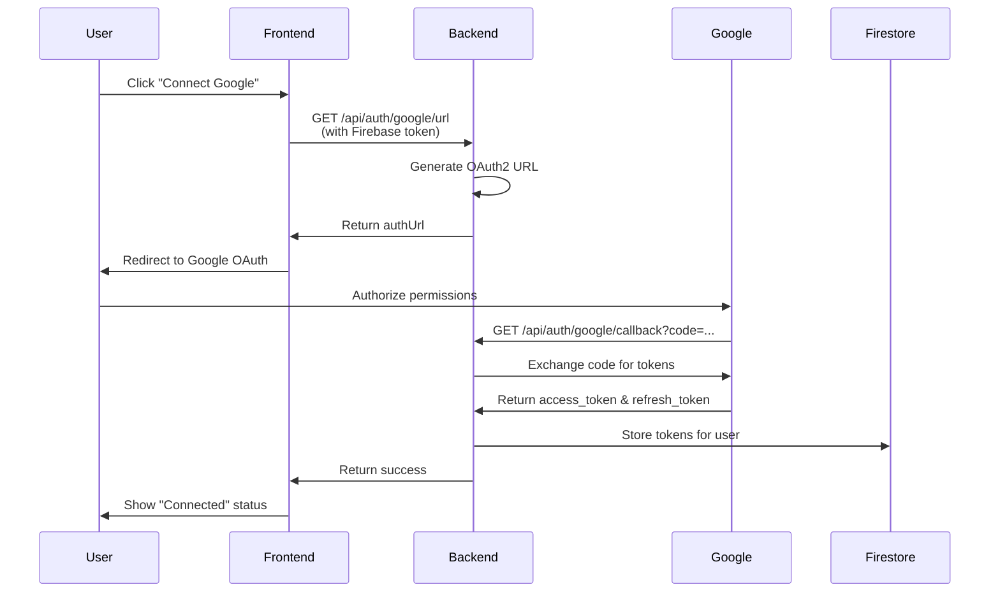
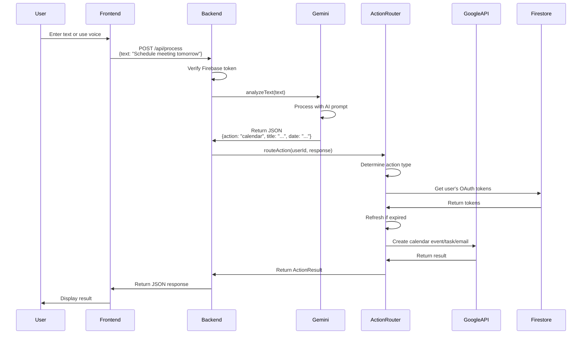

# Application Flow Diagram

## Complete Application Flow



## OAuth2 Authentication Flow



## Text Processing Flow



## Data Structures

### Gemini Response Structure

```typescript
{
  action: "calendar" | "task" | "email" | "unknown",
  title?: string,
  description?: string,
  date?: string,        // ISO date or relative ("tomorrow")
  time?: string,         // HH:MM format
  duration?: number,     // minutes (for calendar)
  location?: string,     // for calendar events
  recipient?: string,    // email address
  subject?: string,      // email subject
  body?: string,         // email body
  dueDate?: string,      // for tasks
  priority?: "low" | "medium" | "high"
}
```

### API Response Structure

```typescript
{
  success: boolean,
  action: string,
  message: string,
  data?: {
    id: string,
    title?: string,
    start?: string,
    end?: string,
    // ... other fields depending on action
  }
}
```


